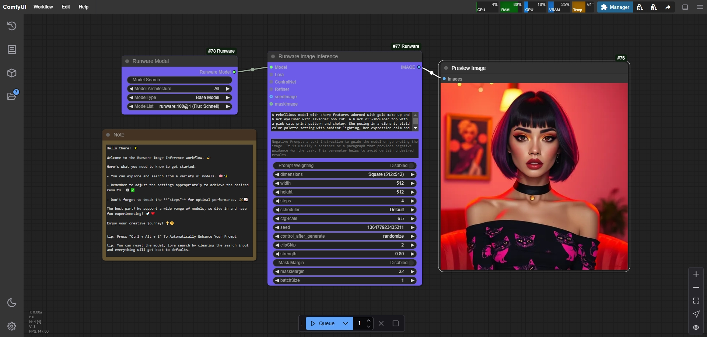

# ComfyUI-Runware Integration 🚀

Welcome to **ComfyUI-Runware**! 🌟 This is the official integration for **Runware**, bringing you the power of **inference-as-a-service** directly into **ComfyUI**! 

## 🌟 What is ComfyUI-Runware?

Imagine creating stunning images, refining details, or even removing backgrounds—all without needing a powerful GPU. With **Runware**, all the heavy lifting happens on our servers. No GPU? No problem! 🖥️💨 

This integration adds a suite of custom nodes to ComfyUI, allowing you to:
- Perform advanced image inference tasks
- Utilize photomaker pipelines
- Upscale images
- Remove backgrounds
- Leverage specialized models and LoRAs

... and so much more! Let’s make your workflows seamless and efficient with **Runware**. 🖌️✨

---

## 📖 Table of Contents

1. [Introduction](#-what-is-comfyui-runware)
2. [Installation](#-installation)
3. [Node Features](#-node-features)
4. [Support & Community](#-support--community)

---

Here’s a sneak peek of the ComfyUI-Runware nodes in action:



---

## 🔧 Installation

### Step 1: Install ComfyUI

First, ensure you have ComfyUI installed. You can follow the [pre-built package guide](https://docs.comfy.org/get_started/pre_package) or the [manual installation guide](https://docs.comfy.org/get_started/manual_install).

Make sure your system meets these requirements:
- **Python 3.10+**
- **ComfyUI installed**

### Step 2: Install ComfyUI-Runware

You have two options to install this integration:

#### Option 1: Using ComfyUI Manager (Recommended)
You can easily install ComfyUI-Runware via the ComfyUI Manager. Just search for "ComfyUI-Runware" and install with a single click! ✨

#### Option 2: Manual Installation

1. Navigate to the custom nodes directory:
   ```bash
   cd custom_nodes
   ```

2. Clone the repository:
   ```bash
   git clone https://github.com/Runware/ComfyUI-Runware.git
   ```

3. Install dependencies:
   ```bash
   pip install -r requirements.txt
   ```

### Step 3: Run ComfyUI

Start ComfyUI with the following command:
```bash
python main.py --front-end-version Comfy-Org/ComfyUI_frontend@latest
```

#### Optional: CPU-Only Mode
If you want to run ComfyUI without a GPU, add the `--cpu` flag:
```bash
python main.py --cpu --front-end-version Comfy-Org/ComfyUI_frontend@latest
```

### Step 4: Explore Workflows
Inside the `comfyui-runware` custom node folder, you’ll find a `workflows` folder with pre-made workflows to get you started! 🚀

---

## 🧩 Node Features

Here’s a breakdown of the amazing nodes included in this integration:

- **Runware API Manager**: Set your API keys directly in ComfyUI—no need to edit config files manually! 🔑
- **Runware Image Inference**: Perform advanced tasks like inpainting, outpainting, and more. 🎨
- **Runware PhotoMakerV2**: Create consistent identities with our photomaker pipeline. 🖼️
- **Runware Image Upscale**: Upscale your images up to 4x. 🔍
- **Runware Background Removal**: Effortlessly remove image backgrounds. 🧹
- **Runware LoRA**: Search and select LoRAs to enhance your workflow. 📂
- **Runware Model**: Choose specific models to connect with image inference. 🤖
- **Runware ControlNet**: Guide your image generation with ControlNet and guide images. 🗺️
- **Runware Refiner**: Refine your images with advanced tools. ✨
- **Runware LoRA Combine**: Combine up to 3 LoRAs together. 🔗
- **Runware ControlNet Combine**: Combine multiple ControlNets for complex workflows. 🧩
- **Runware Image Masking**: Automatically mask elements like faces, hands, and more. 🖌️
- **Runware ControlNet Preprocessor**: Preprocess images before using them as guide images in ControlNet. 🔄

---

## 🤝 Support & Community

This is the **official Runware integration**, maintained by **Runware Inc**. We’re here to help you every step of the way! 💬

Join our community on Discord for support, updates, and to connect with fellow creators: [Runware Discord](https://discord.com/invite/aJ4UzvBqNU) 🎉

---

Thank you for using **ComfyUI-Runware**! Let’s create something amazing together. 🌟